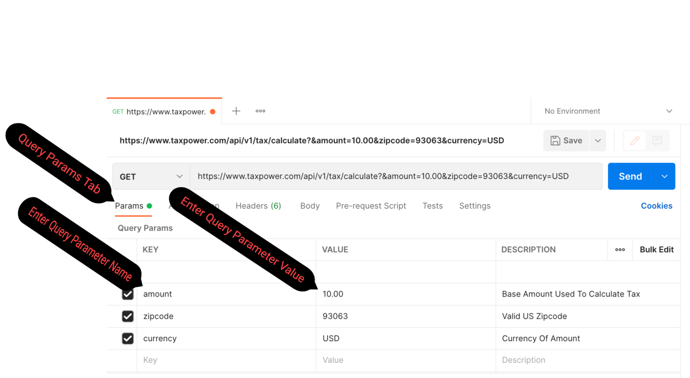

## Use The Postman Client To Make Your First Request To The TaxPower API

- **If you'd like to use the Postman client to communicate with the TaxPower API, you need to download it for your operating system. You can find the client [here](https://www.postman.com/downloads/postman-agent/).**

- **The screenshots that follow on this page use the Mac version of Postman.**

1. **Open up the Postman application. You should see something like this:**

---


---

2. **Click the PLUS icon to create a new request.**

---


---

3. **Enter the calculate tax endpoint in the URL BOX, and make sure the GET HTTP method is selected.**


 ```
 https://www.taxpower.com/api/v1/tax/calculate
 ```

---


---

4. **Select the Params tab, and add the amount, zipcode, and currency as [Query Parameters](https://branch.io/glossary/query-parameters/).**
  
  - For a full characterization of the available query parameters, see the [API Reference](../../api-reference.md).

  - When you enter the name and value for a query parameter in the Params tab, it will automatically append that key/value pair to the URL.
  
---



---

5. **Select the Headers tab, and add your API key as the value for the "api_key" header.**

  - If you don't have an API key yet, you can find the instructions to generate one [here](../generate-api-key). 

---


---

6. **The request is now ready to be sent. Click the SEND button.**

7. **Congratulations, you've successfully made your first request to the TaxPower API! The 200 success response from the TaxPower server will contain some JSON data that includes the tax for the base amount. It should look something like this:**

```json
{
  "statusCode": 200,
  "data": {
    "zipcode": 93063,
    "currency": "USD",
    "baseAmount": 10,
    "taxRate": 0.1,
    "tax": 1,
    "totalAmount": 11
  }
}
```

