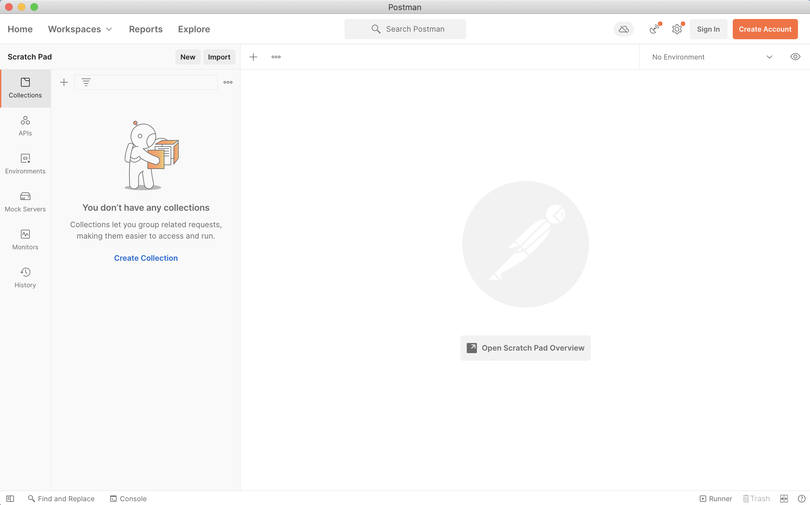
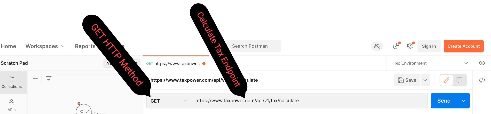

## Use The Postman Client To Make Your First Request To The TaxPower API

- **If you'd like to use the Postman client to communicate with the TaxPower API, you need to download it for your operating system. You can find the client [here](https://www.postman.com/downloads/postman-agent/).**

- **The screenshots that follow on this page use the Mac version of Postman.**

1. **Open up the Postman application. You should see something like this.**

---



---

2. **Click the PLUS icon to create a new request.**

---


---

3. **Enter the calculate tax endpoint in the URL BOX, and make sure the GET HTTP method is selected.**


 ```
 https://www.taxpower.com/api/v1/tax/calculate
 ```

---



---